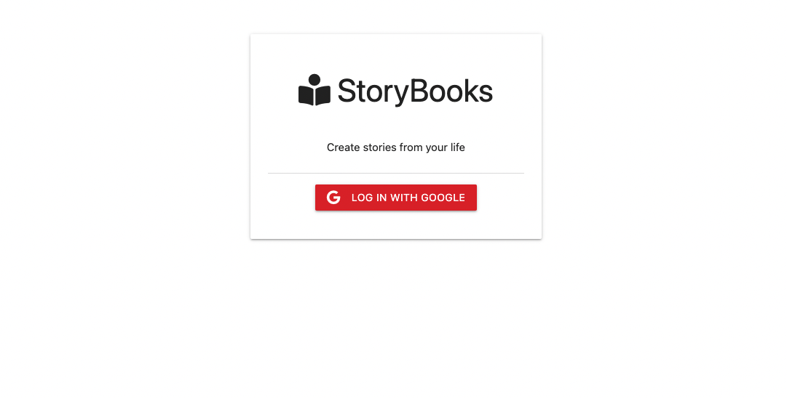

# Storybooks App with Authentication 
Using google Oauth2.0 users can log in and create storybooks with full crud capabilities. Set private and public stories and display stories depending on the user account.

**Link to project:** https://storybooks-with-google-auth.herokuapp.com/

## How It's Made:

**Tech used:** HTML, CSS, JavaScript, Node.js, Express.js, Mongodb

## Optimizations
*(pending)*

## Lessons Learned:

Mongoose Schemas help make sure our data is sctructured consistently.

## Examples:
Take a look at these couple examples that I have in my own portfolio:

**CRUD Todo List App:** https://github.com/VENGEAANCE/CRUD-Todo-List-App

